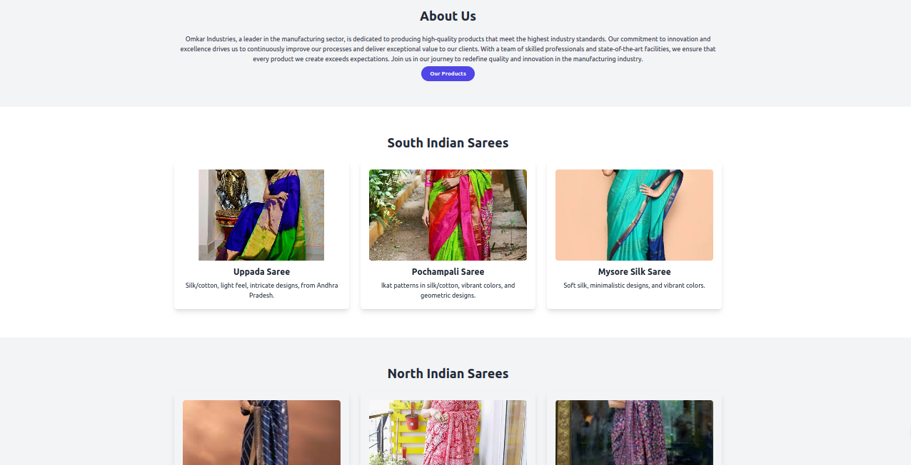

# Omkar Industries

Welcome to the Omkar Industries website project! This project showcases a modern, responsive website for Omkar Industries, using Tailwind CSS, JavaScript, and various animation libraries to provide a unique and engaging user experience.

## Table of Contents

- [About](#about)
- [Features](#features)
- [Demo](#demo)
- [Installation](#installation)
- [Contributing](#contributing)
- [License](#license)
- [Contact](#contact)

## About

Omkar Industries is a leader in the manufacturing sector, dedicated to producing high-quality products that meet the highest industry standards. Our website is designed to reflect our commitment to innovation and excellence, providing visitors with an engaging and informative experience.

## Features

- **Responsive Design**: Adjusts seamlessly to different screen sizes.
- **Contact Form**: Includes client-side validation with a success message using SweetAlert.
- **Animated Mobile Menu**: Features a fade-in and fade-out effect for the mobile menu.

## Demo

Include a link to a screenshots of the project.



## Installation

### Prerequisites

Ensure you have the following installed:

- Web Browser (e.g., Chrome, Firefox)

### Steps

1. Clone the repository:

    ```bash
    git clone https://github.com/Vasoyasharan/OmkarIND.git
    ```

2. Navigate to the project directory:

    ```bash
    cd OMKAR IND
    ```

3. Open `index.html` in your preferred web browser to view the project.

## Contributing

We welcome contributions to enhance this project. Follow the steps below to contribute:

1. Fork the repository.
2. Create a new branch for your feature (`git checkout -b feature-branch`).
3. Make your changes and commit them (`git commit -m 'Add new feature'`).
4. Push to the branch (`git push origin feature-branch`).
5. Open a pull request and describe your changes.

### Code of Conduct

By participating in this project, you agree to abide by the [Contributor Covenant Code of Conduct](link-to-code-of-conduct).

## License

This project is licensed under the MIT License. See the [LICENSE](LICENSE) file for more information.

## Contact

Project Maintainer - [Sharan Vasoya](mailto:sharanvasoya@proton.me)

For issues, questions, or contributions, please contact us at [sharanvasoya@potone.me](mailto:sharanvasoya@protone.me).